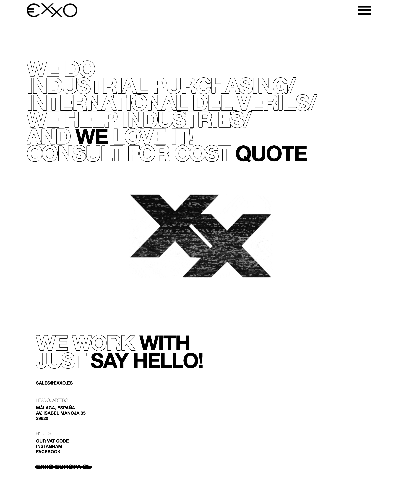

# Landing Page with Bootstrap

This landing page is part of my front-end practices. Use the following resources:

- Bootstrap 4
- AWS Amazon
- Captcha
-

## Challenge

- ~~Create the main landing page.~~
- ~~Reuse navigation bar and footer in a separate html file.~~
- ~~Text with loading effect.~~
- Loader page
- ~~Indexed CSS~~
- Backend foms with php
- Scss
- Create a contact form with Nodemailer, React, and Express
- Capcha in forms
- Optimice Site: minify and uglify; JS, HTML, CSS.
- Optimice Site: resize images based on size it will be displayed. [CSS Media Query Cheat Sheet (with Foundation) ](https://gist.github.com/bartholomej/8415655)
- Add more challenges

## Preview

]

**[View Live Preview](https://exxo.es)**

This landing page was created by and is maintained by **[Juan Pablo Devecchi Martinengo](http://JPDevM.com/)**.

- http://JPDevM.com
- https://twitter.com/JPDevM
- https://github.com/JPDevM

## Copyright and License

Copyright 2020. Code released under the [MIT](https://github.com/) license.
